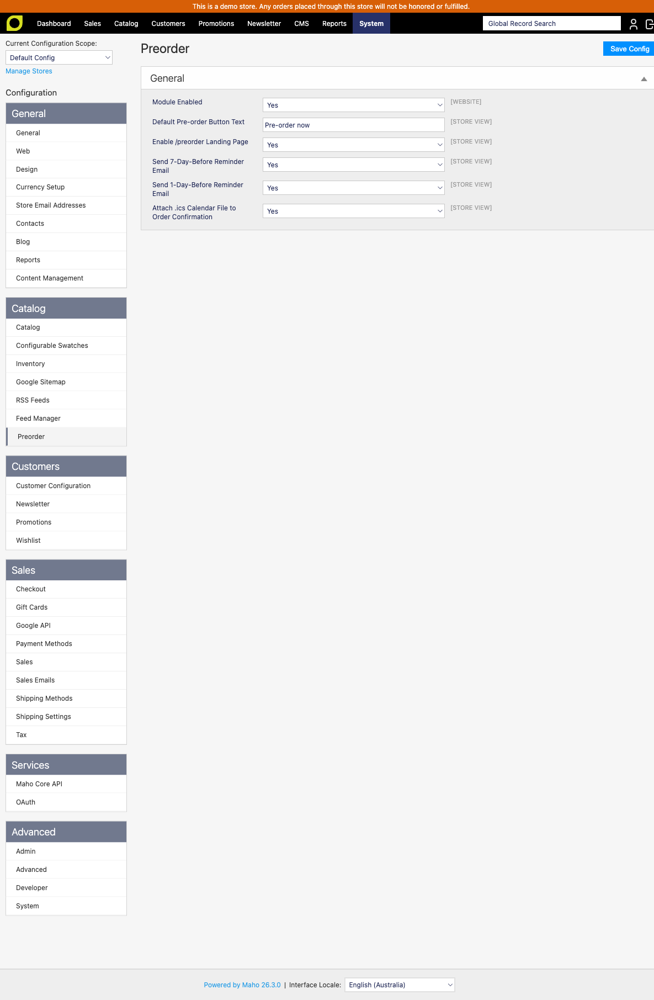
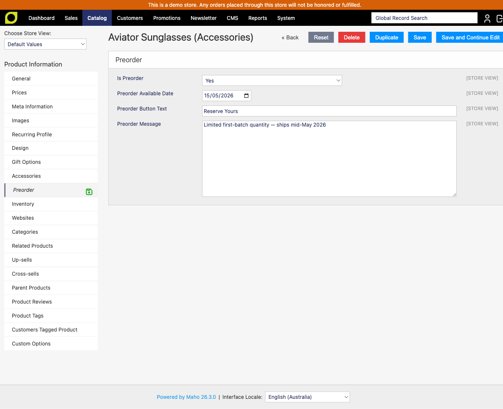
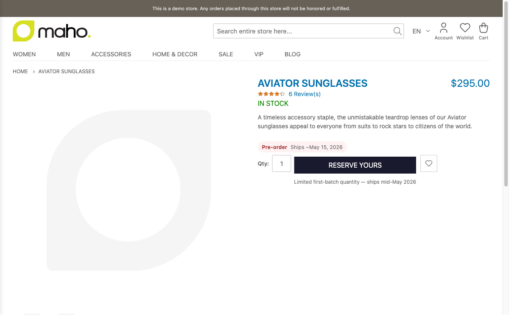
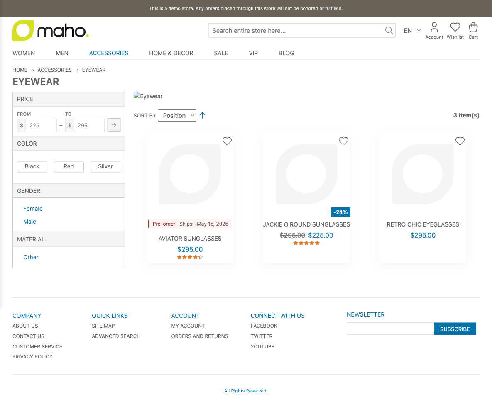
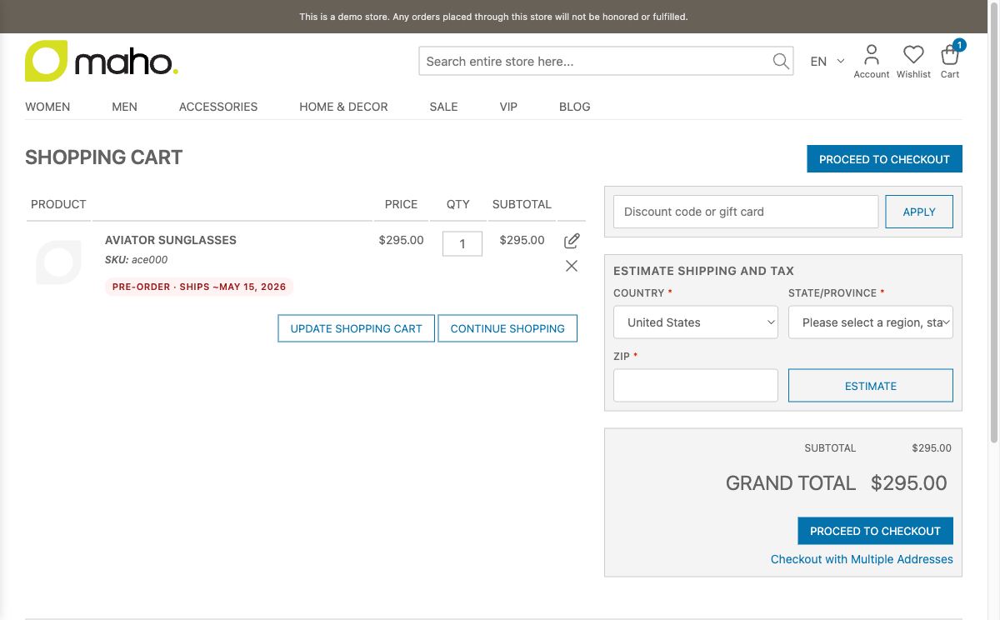
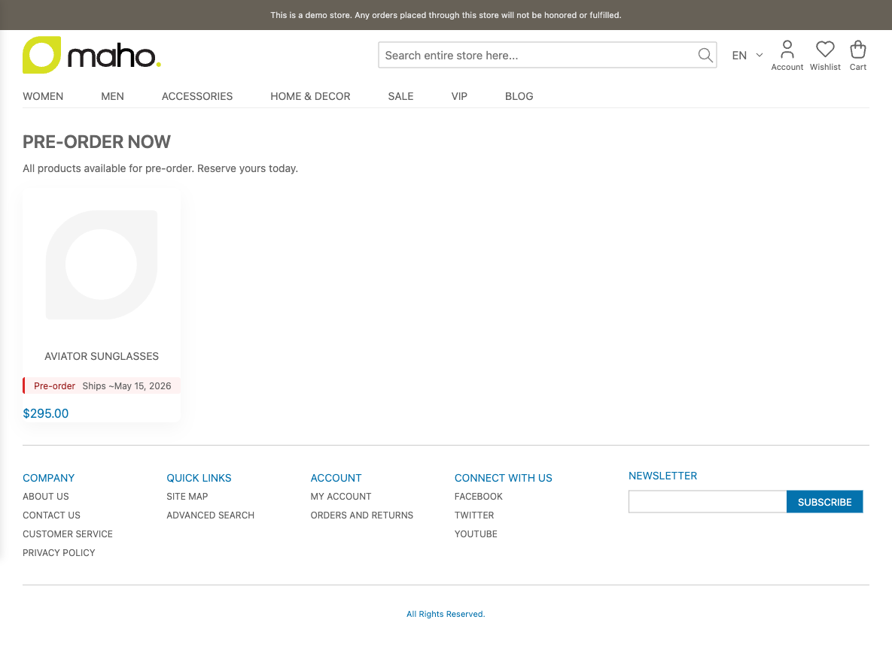
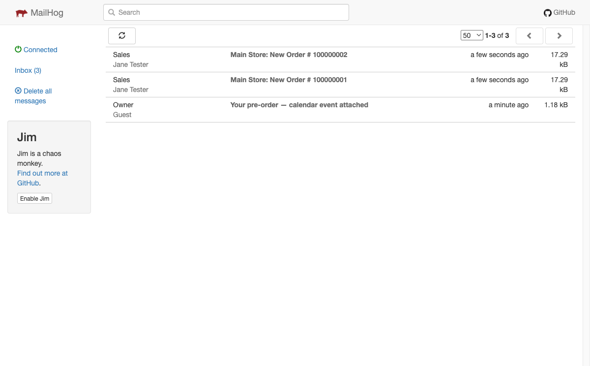
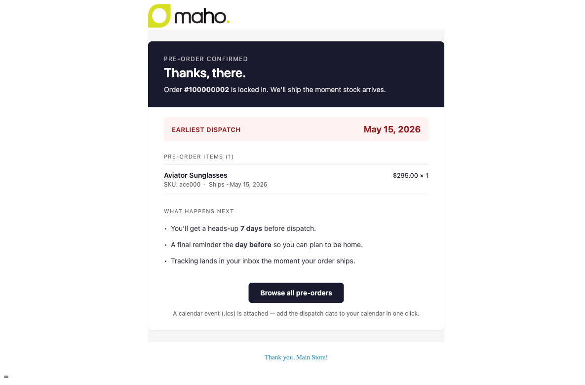
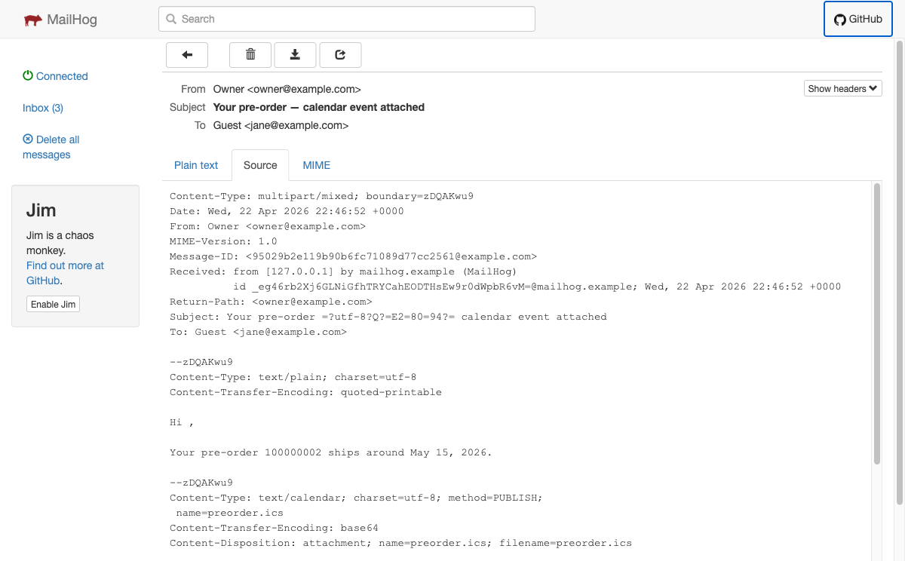

# Mageaustralia_Preorder

Pre-order workflow for Maho. Lets merchants accept orders for products before they're in stock, with a known availability date, the right labels everywhere, and an SEO landing page no other module ships.

**Status:**
- **Phase 1 (this release):** PDP preorder badge + button, cart line label, order item flag, admin config + product attributes.
- **Phase 2** (`/preorder` SEO landing page with `schema.org` structured data) — coming.
- **Phase 3** (`.ics` calendar attachment + lifecycle reminder emails) — coming.

**Requires:** [Maho](https://github.com/mahocommerce/maho) (PHP 8.3+, Maho ≥26.3)

[](https://github.com/mageaustralia/maho-storefront)
[](LICENSE)

## Unique / Distinctive Feature(s)

- **Auto-generated `/preorder` SEO landing page** — every preorder product appears at a public URL with `schema.org/Product` structured data and sitemap inclusion. Indexable, rankable, marketing-ready out of the box. *No M2 incumbent ships this.*
- **`.ics` calendar export** attached to order confirmation — customers add the dispatch date to their calendar in one click.
- **Lifecycle reminder emails** at 7-day and 1-day-before-dispatch.
- **Maho Storefront ready** — works in headless setups out of the box; no separate install.
- **SQLite + PostgreSQL compatible** in addition to MySQL/MariaDB.

## Install

```bash
composer require mageaustralia/maho-module-preorder
```

Then in admin: System > Cache Management > Flush Magento Cache, and System > Configuration > Catalog > Preorder to set defaults.

## Local development & testing

Use the [maho-playwright-rig](https://github.com/mageaustralia/maho-playwright-rig) — a shared Docker harness for end-to-end testing. The legacy per-module `docker/` stack has been removed.

```bash
git clone git@github.com:mageaustralia/maho-playwright-rig.git
cd maho-playwright-rig
./scripts/fresh-install.sh --sample              # one-time, ~3 min
./scripts/seed-module.sh ../maho-module-preorder # bind-mount this module
docker exec maho-rig-web /app/maho migrate       # apply preorder schema
```

Storefront on `http://localhost:8088`, admin on `/admin` (`admin` / `Admin1234_local`), Mailhog on `http://localhost:8028`.

## Screenshots

The full smoke walkthrough captured against a fresh sample-data install:

| Step | Screenshot |
|---|---|
| System config (Catalog > Preorder) |  |
| Product edit — Preorder tab |  |
| PDP — badge + custom CTA + message |  |
| Category list — badge on product card |  |
| Shopping cart — preorder line label |  |
| `/preorder` SEO landing page |  |
| Mailhog inbox |  |
| Confirmation email |  |
| `.ics` calendar attachment (MIME source) |  |

## Configure

| Setting | Default | Description |
|---|---|---|
| Default button text | "Pre-order now" | Override per-product if needed |
| Send 7-day reminder | yes | Email sent 7 days before `preorder_available_date` |
| Send 1-day reminder | yes | Email sent 1 day before |
| `/preorder` page enabled | yes | Set to no to disable the landing page |

## Use

On any product, set:
- **Is Preorder**: Yes
- **Preorder Available Date**: when it ships
- (optional) **Preorder Button Text**: custom CTA
- (optional) **Preorder Message**: e.g. "Limited first-batch quantity"

That's it. Frontend updates automatically.

## Pro Version

`Mageaustralia_PreorderPro` adds: waitlist / notify-when-available, deduct-at-ship inventory rule, deposits / partial payment, preorder-specific promotions, and an admin dashboard with **AI demand forecasting**. See [mageaustralia.com.au/preorder-pro](https://mageaustralia.com.au/preorder-pro) ($119 single-store / $249 unlimited).

## License

Apache 2.0 — see [LICENSE](LICENSE).

## Contributing

PRs welcome. See [CHANGELOG.md](CHANGELOG.md).
